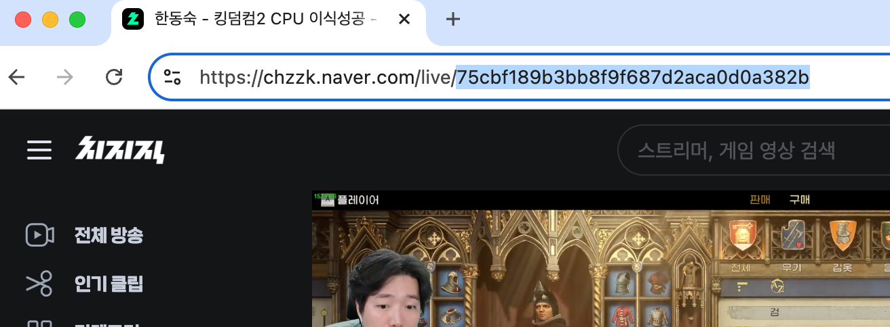

# Chzzk Chat Crawler Golang Library


This library provides a crawler for streaming game chat messages from [Chzzk](https://chzzk.naver.com/) game streaming platform. It captures real-time chat data, including usernames and messages, and allows users to process or store this information for further analysis or application integration.

## Features
- Real-time crawling of chat messages.
- Support for custom message handling.
- Easy integration with Go applications.

## Installation

### Requirements

- Go 1.22.2 or higher

To install, ensure that you have Go 1.22.2 or a later version installed. You can verify your Go version by running:

```bash
go version # >= 1.22.2 
```

To use this library, you need to have Go installed. You can install the library by running the following command in your project:

```bash
go get github.com/dhkimxx/GoChzzkChatCrawler
```

## Usage
Below is an example of how to use this library in your project.

### Example Code

1. Using a Callback Handler
    ```go
    package main

    import (
        "fmt"

        "github.com/dhkimxx/GoChzzkChatCrawler/crawler"
    )

    func main() {
        streamerId := "<your_streamer_id>"

        // Create a new crawler client with callback handler
        crawlerClient := crawler.NewCrawlerClient(streamerId, 1, func(msg crawler.ChzzkChatMessage) {
            fmt.Printf("[%d] %s: %s\n", msg.Timestamp, msg.Nickname, msg.Content)
        })

        // Start crawling
        err := crawlerClient.Run()
        if err != nil {
            panic(err)
        }
    }
    ```

2. Using a Channel
    ```go
    package main

    import (
        "fmt"

        "github.com/dhkimxx/GoChzzkChatCrawler/crawler"
    )

        streamerId := "<your_streamer_id>"

        // Create a new crawler client
        crawlerClient := crawler.NewCrawlerClient(streamerId, 1, nil)

        // Start crawling in a separate Goroutine
        go func() {
            err := crawlerClient.Run()
            if err != nil {
                panic(err)
            }
        }()

        // Process chat messages from the channel
        for msg := range crawlerClient.ChatChan {
            fmt.Printf("[%d] %s: %s\n", msg.Timestamp, msg.Nickname, msg.Content)
        }
    ```


## ETC

You can check the streamer id from the streamer broadcast page URL as shown in the image below.
(`https://chzzk.naver.com/live/<streamer_id>`)

